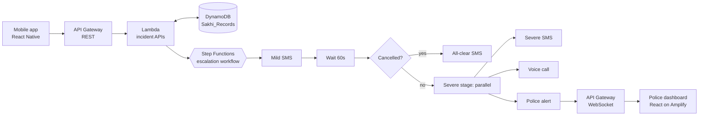

# Sakhi: an emergency safety app that listens for you

> Built for the **WeMakeDevs x AWS "First Commit" hackathon (Bharat Builds Tour, Event 01)**.

In an attack, the victim usually can't reach her phone, so an SOS button doesn't help. Apps that auto-alert have the opposite problem: false alarms scare people away from using them.

**Sakhi** listens for screams, threats, or a secret codeword, then gives the user a **60-second window** where only her **fingerprint** can cancel. If she doesn't cancel, Sakhi escalates automatically: family, an automated call, and a live alert on a police control-room dashboard.

## Live links

| Component | Link |
|---|---|
| Backend API (dev stage) | https://mhkvqscbve.execute-api.ap-south-1.amazonaws.com/dev/ |
| Police dashboard (Amplify) | https://staging.d3coiri9lx0kr0.amplifyapp.com/ |
| Demo video | https://youtu.be/8z_k53131Xs |

## How it works

There are two separate flows.

### 1. Scream or codeword: 2-stage escalation (60s cancel window)

1. **Trigger:** the app detects a scream or the user's codeword and calls `POST /incidents`.
2. **Stage 1 (T = 0):** a **mild alert** goes to family with live location. The phone starts a continuous vibration and beep. A Step Functions workflow begins a 60-second wait.
3. **Cancel window (T = 0 to 60s):** the user can cancel **only by biometric authentication**. On success the incident is marked `CANCELLED` and family gets an **all-clear**.
4. **Stage 2 (T = 60s, not cancelled):** the workflow runs three actions **in parallel**:
   - Severe SMS to family
   - Automated voice call to family
   - Live emergency packet (photo, name, age, address, live location) pushed to the **police/helpline dashboard** over a WebSocket

Police and the helpline are **never** contacted during the mild first minute.

### 2. Manual alert: family only, no timer

A separate button for situations that just feel off. It sends one immediate live-location message to family. No timer, no escalation, no police involvement.

## Architecture



**Why Step Functions?** The 60-second wait, the cancellation check, and the parallel fan-out are exactly what it's built for. No servers, timers, or polling loops in application code.

## Tech stack

| Layer | Tech |
|---|---|
| Mobile client | React Native, TypeScript, biometrics, background audio |
| Backend | Python 3.11, AWS Lambda, Boto3 |
| Orchestration | AWS Step Functions (Amazon States Language) |
| Data | Amazon DynamoDB (single-table design) |
| API | Amazon API Gateway (REST + WebSocket) |
| Messaging and voice | Amazon SNS (SMS), Amazon Connect (voice) |
| Dashboard | React, Tailwind CSS, Vite, hosted on AWS Amplify |
| Infrastructure as code | AWS SAM (`template.yaml`) |

## What is real vs. mocked

Being upfront about the current state:

| Component | Status |
|---|---|
| Step Functions workflow (wait, cancel check, parallel branches) | Live on AWS |
| REST API, Lambdas, DynamoDB | Live on AWS |
| WebSocket push to police dashboard | Live on AWS |
| Biometric cancellation flow | Calls the real API |
| Mild, severe, and all-clear **SMS** | **Mocked**: logged to CloudWatch (`MOCK_SNS`), due to AWS credit limits |
| Automated **voice call** | **Mocked**: logged to CloudWatch |
| Police / helpline | **Simulated** control-room dashboard (there is no public police dispatch API) |

The mocked Lambdas build the exact message payloads. Turning on real SMS and voice is a configuration change, not a redesign. See `backend/REAL_FAMILY_ALERTS_SETUP.md`.

## API

| Method | Route | Purpose |
|---|---|---|
| POST | `/users` | Create or update profile (name, age, phone, address, photo, codeword, inference preference, emergency contacts) |
| POST | `/incidents` | Start a scream or codeword incident and the 2-stage workflow. Returns `incidentId` |
| POST | `/incidents/manual` | Family-only alert, no timer |
| POST | `/incidents/:id/cancel` | Biometric cancel (only valid inside the 60s window) |
| POST | `/incidents/:id/location` | Live location updates during an active incident |
| GET | `/incidents/:id/status` | `STAGE_1_PENDING`, `CANCELLED`, or a dispatched state |

**WebSocket:** the dashboard receives an `ACTIVE_EMERGENCY_DISPATCH` event **only** at the severe stage.

## Data model (DynamoDB, table `Sakhi_Records`)

```
USER#<userId>     / PROFILE   -> name, age, phoneNumber, address, photoUrl,
                                 customCodeword, inferencePreference,
                                 emergencyContacts[]

INCIDENT#<id>     / METADATA  -> userId, status, triggerType, timestamp,
                                 currentLocation{}, audioSnippetUrl,
                                 cancellationTime
```

## Repository structure

```
sakhi/
├── backend/
│   ├── connect/          # Amazon Connect setup for outbound voice
│   ├── src/              # Lambda functions (Python)
│   ├── statemachine/     # Step Functions definition (.asl.json)
│   ├── template.yaml     # SAM template (all AWS resources)
│   └── REAL_FAMILY_ALERTS_SETUP.md
├── dashboard/            # Police / helpline control-room dashboard (React + Tailwind)
│   └── src/
└── mobile/               # React Native app (in progress, see Team)
```

## Getting started

### Backend

Prerequisites: AWS CLI configured, AWS SAM CLI, Python 3.11.

```bash
cd backend
sam build
sam deploy --guided
```

Set `MOCK_SNS=true` (default for the demo) to log messages instead of sending real SMS.

### Dashboard

```bash
cd dashboard
npm install
cp .env.example .env    # set your WebSocket URL
npm run dev
```

## Team

| Who | Owns |
|---|---|
| **Raghav** ([@RaghavAgarwal-01](https://github.com/RaghavAgarwal-01)) | AWS backend (Step Functions, Lambdas, DynamoDB, REST + WebSocket APIs) and the police/helpline dashboard |
| **[Teammate name]** | **Mobile client** (React Native + TypeScript), described below |

### What the mobile app will do

- **Background audio monitoring** via a persistent foreground service, so Android and iOS don't kill it. A low-power volume gate sleeps until a loud spike, then captures a 5-second chunk for classification.
- **Local or cloud inference:** the user chooses to run the open-source audio model on-device (downloaded) or offload it to AWS for low-spec phones (`inferencePreference: LOCAL | CLOUD`).
- **Codeword spotting:** a user-set secret phrase that triggers the alarm.
- **Alarm with 60s countdown:** continuous vibration and beep to tell the user an alarm fired, so false alarms can be caught.
- **Biometric-only cancel:** fingerprint or Face ID is the only way to stop the alarm. On success it calls `POST /incidents/:id/cancel`.
- **Manual alert button:** family-only live-location ping, visually and behaviorally distinct from the alarm flow.
- **Live GPS streaming** to `POST /incidents/:id/location` while an incident is active.
- **Profile setup:** name, age, address, emergency contacts, codeword.

The mobile app conforms to the API contract above.

## Roadmap

- Enable real SNS SMS and Amazon Connect voice calls
- On-device quantized audio model (TFLite / ONNX) and scream classification hardening
- Real integration path for police and women's helpline dispatch
- Cedar-based authorization for role-scoped access

## Hackathon

Submitted to **WeMakeDevs x AWS First Commit** (Sept 17-20, 2026): _Ship It_ track (deployed on AWS with a public URL).
